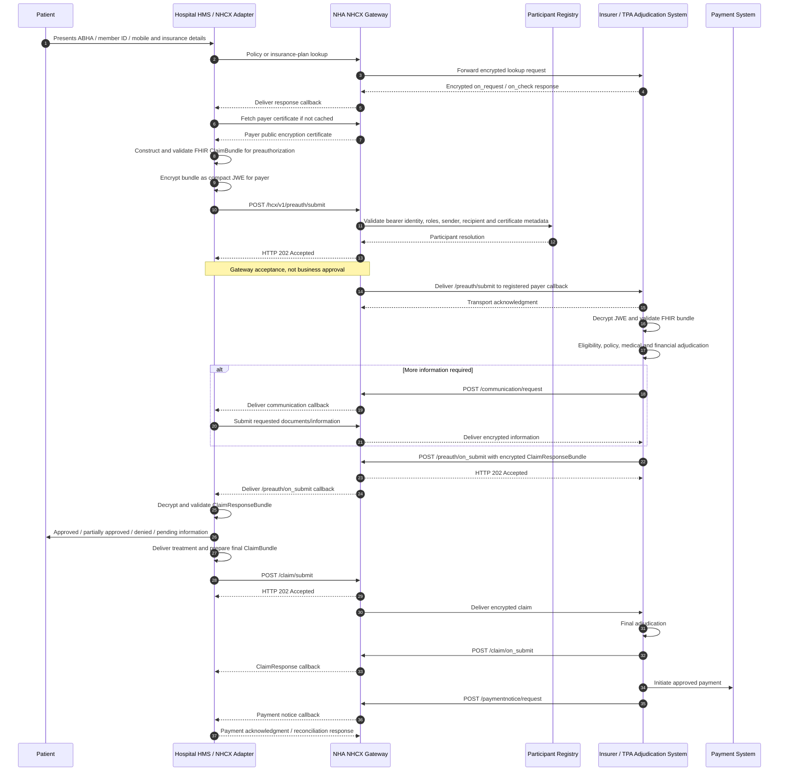
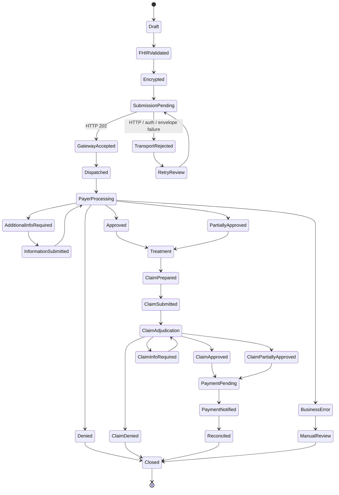
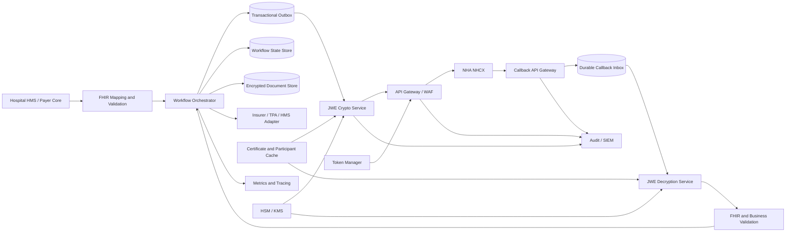

# National Health Claims Exchange APIs and End-to-End NHA Approval Flows

## Executive summary

The publicly verifiable NHCX implementation is not represented by one complete, versioned API specification. It is distributed across the National Health Authority’s NHCX website, an official but relatively sparse NHA GitHub repository containing Postman collections, the NRCeS ABDM FHIR Implementation Guide, the open HCX Protocol documentation, a substantial earlier reference implementation maintained by the Swasth Digital Health Foundation, and implementation evidence published by participating insurers. The official NHA repository nevertheless provides concrete sandbox and production URLs, request bodies, participant-onboarding calls, callback paths, JWT-bearing headers, compact JWE payloads, and participant-certificate operations. citeturn18view0turn21view0turn20view2turn14search3

The most important semantic distinction is that **NHA approval and insurance approval are different processes**:

* **NHA approves or enables an organization as an NHCX participant**, including its participant identity, roles, encryption certificate and callback endpoint, and requires sandbox testing or certification before production.
* **The payer, insurer or TPA approves or rejects a preauthorization or claim.** NHCX is primarily a routing, validation, registry and secure-exchange gateway. An HTTP `202 Accepted` from NHCX is therefore not a medical or financial approval; it means that the exchange accepted the message for asynchronous processing. The eventual business decision arrives in an `on_submit` callback, normally carrying an encrypted FHIR ClaimResponse bundle. citeturn15view4turn10search3turn10search16turn14search3

Three independent version axes must be managed:

| Version axis | Publicly evidenced version | Meaning |
|---|---:|---|
| NHA use-case API path | `/hcx/v1` | Runtime URL version used by the official NHA sandbox Postman collection. citeturn23view1turn23view2 |
| NHA participant-onboarding API | `/v2/participant/create` and `/v2/participant/update` | Production participant registration/update operations. Other validation paths in the same collection are not under `/v2`. citeturn20view2turn20view3 |
| Open HCX protocol | `v0.9`, December 2023 draft | Protocol semantics, asynchronous message pattern, domain headers, errors and security model. It should not automatically be equated with the NHA `/v1` runtime path. citeturn10search0 |
| ABDM FHIR Implementation Guide | `v6.5.0`, FHIR R4.0.1 | Current public health-claim payload profiles and examples. citeturn1view3turn14search3 |

The strongest technical conclusions are:

1. **Transport is HTTPS and JSON.** The official NHA collection submits an outer JSON envelope, usually containing a compact JWE string. citeturn23view0turn23view1
2. **Authentication is bearer-JWT based in the public artifacts.** The sample JWTs are RS256 tokens with client and role claims. The official collection, however, uses a custom-looking header named `bearer_auth`, while the open protocol and conventional HTTP practice use `Authorization: Bearer`. This discrepancy must be resolved with the current NHA sandbox before production. citeturn23view0turn11search0
3. **Payload confidentiality is end-to-end JWE.** NHA samples use `RSA-OAEP-256` for key encryption and `A256GCM` for authenticated content encryption. The protected JWE header carries routing and correlation metadata, while the ciphertext contains the FHIR bundle. citeturn8view0turn10search6turn9search1
4. **The business payload standard is HL7 FHIR R4, not HL7 v2.** The current NHCX profiles include ClaimBundle, ClaimResponseBundle, CoverageEligibilityRequestBundle, CoverageEligibilityResponseBundle and InsurancePlanBundle. Public evidence does not establish that the NHA runtime accepts FHIR XML, generic XML or HL7 v2 messages. citeturn14search3turn2view2turn2view3turn2view4turn2view5
5. **The architecture is asynchronous and callback-oriented.** Operations follow an `action` / `on_action` pattern—for example, `/preauth/submit` followed by `/preauth/on_submit`. citeturn10search4turn10search16turn23view2
6. **Mutual TLS, exact OAuth grant type, normative idempotency behavior, retry intervals, callback timeout, key-rotation procedure, throughput limits and exchange-level latency SLA are not completely specified in the public NHA artifacts reviewed.** They should be treated as unresolved production-onboarding questions, not inferred requirements.
7. **Production use is real.** NHA reported that 34 insurers and TPAs were live and approximately 300 hospitals were ramping up as of July 21, 2024. HDFC ERGO separately reported processing its first NHCX health claim. These are operational proofs, although neither source publishes the implementation code or complete production interface contract. citeturn15view4turn15view1

The principal implementation risk is therefore not generating FHIR or encrypting JWE; it is operating a durable asynchronous transaction system around incomplete public semantics. A production integrator should maintain its own state machine, inbox/outbox queues, duplicate detection, certificate cache, callback authentication controls, immutable audit records and reconciliation jobs, while obtaining written confirmation from NHA for all unspecified behaviors.

## Evidence base and interpretation of “NHA approval”

The following evidence hierarchy was applied:

| Evidence class | Sources | Confidence and limitations |
|---|---|---|
| Official NHA runtime artifacts | [NHA-ABDM NHCX GitHub repository](https://github.com/NHA-ABDM/nhcx), official sandbox and production Postman collections | Highest confidence for actual public URLs and payload examples. The repository has only a small commit history, no tagged release and no complete OpenAPI specification; some embedded tokens are historical and one endpoint contains an evident URL typo. citeturn18view0turn23view3 |
| Official payload standard | [NRCeS ABDM FHIR Implementation Guide](https://www.nrces.in/ndhm/fhir/r4/hcx-profile.html) | Highest confidence for FHIR R4 profiles and conformance requirements. The IG version is independent of the transport API version. citeturn1view3turn14search3 |
| Open protocol specification | HCX Protocol v0.9 documentation | Strong evidence for message semantics, domain headers, callbacks, encryption, errors and audit behavior. It predates or underpins NHCX but is not, by itself, proof that every NHA production behavior is identical. citeturn10search0turn9search1turn10search3 |
| Government operational evidence | NHA/PIB announcements | Strong evidence of rollout and gateway role, but not a technical interface contract. citeturn15view4turn14search7 |
| Open-source reference implementation | [Swasth hcx-platform](https://github.com/Swasth-Digital-Health-Foundation/hcx-platform) | Valuable architecture and implementation evidence. It contains API services, asynchronous pipelines, registry schemas, gateway configuration and onboarding code, but it should not be assumed to be the current NHA production codebase. citeturn15view0turn17view0 |
| Participant implementation evidence | [HDFC ERGO NHCX implementation announcement](https://www.hdfcergo.com/news/health-insurance/hdfc-ergo-general-insurance-processes-it-s-first-health-claim-through-the-national-health-claims-exchange-platform) | Confirms actual claim processing but exposes no source code, payload captures or infrastructure design. citeturn15view1 |
| Community utilities | Third-party NHCX encryption/decryption repositories | Useful for learning or prototyping only. Public provenance, conformance testing and production certification are generally unproven. citeturn9search2 |

**NHA participant approval.** The NHA production collection exposes participant creation and update APIs. A participant can register details such as registry type, registry identifier, role, callback URL, mobile number and email; update calls carry a participant code, an encryption certificate and an endpoint URL. The collection then invokes validation using a `transactionId` and passcode. It does not document how the passcode is delivered, whether a human review follows validation, the approval SLA or the exact production credential-issuance sequence. citeturn20view2turn20view3

**Payer approval.** For preauthorization and claim transactions, NHCX accepts and routes the request to the payer or TPA identified by the recipient code. The payer decrypts and adjudicates the FHIR bundle and sends the response back through NHCX. NHA operates the exchange and its registry/security controls; it does not ordinarily make the insurer’s coverage or medical-necessity decision. citeturn15view4turn10search3turn10search16

**PM-JAY nuance.** NHA also administers PM-JAY, and public production onboarding paths contain `/pmjay/hcx/`. That administrative relationship does not change the protocol-level distinction: the business response is generated by the relevant scheme, payer or adjudication system, while the NHCX gateway transports the response.

Public rollout evidence should be treated with dates attached. The last unambiguous official deployment count located in this research is **34 insurers/TPAs live and approximately 300 hospitals ramping up as of July 21, 2024**. A March 2026 NHA hackathon announcement shows continued ecosystem development and identifies “NHCX-PMJAY Early Integrators” as a category, but the public material reviewed does not provide a complete, technically verifiable list of their production architectures. citeturn15view4turn14search7

## Protocol, endpoints, authentication and message contracts

The NHCX architecture uses a store-and-forward, asynchronous exchange pattern. A sender submits an encrypted message to the gateway; the gateway validates what it can see, resolves the recipient and forwards the message to that participant’s registered callback endpoint. The recipient later submits an encrypted response to the paired `on_*` API, and NHCX delivers it to the original sender’s callback. citeturn10search3turn10search4

### Public endpoint families

The official NHA sandbox collection uses the base:

```text
https://apisbx.abdm.gov.in/hcx/v1
```

The public use-case operations observed are:

| Workflow | Originating operation | Asynchronous response operation | Intended payload |
|---|---|---|---|
| Insurance-plan discovery | `POST /insuranceplan/request` | `POST /insuranceplan/on_request` | InsurancePlanBundle or related FHIR insurance-plan data. citeturn23view0turn23view1turn14search3 |
| Coverage eligibility | `POST /coverageeligibility/check` | `POST /coverageeligibility/on_check` | CoverageEligibilityRequestBundle / CoverageEligibilityResponseBundle. citeturn23view1turn2view4turn2view5 |
| Preauthorization | `POST /preauth/submit` | `POST /preauth/on_submit` | ClaimBundle with preauthorization use and corresponding ClaimResponseBundle. citeturn23view2turn2view2turn2view3 |
| Claim | `POST /claim/submit` | `POST /claim/on_submit` | ClaimBundle and ClaimResponseBundle. citeturn23view2turn10search16 |
| Predetermination | `POST /predetermination/submit` | `POST /predetermination/on_submit` | ClaimBundle with predetermination semantics and ClaimResponseBundle. citeturn10search16turn2view2 |
| Payment notice | `POST /paymentnotice/request` | `POST /paymentnotice/on_request` | Payment-notification data. The public collection has a malformed `on_request` host string and should not be copied verbatim. citeturn23view3 |
| Communication or additional information | `POST /communication/request` | `POST /communication/on_request` | Supporting communication and requested documentation. citeturn10search6 |
| Reprocessing/task | `POST /task/submit` | `POST /task/on_submit` | Reprocessing or task-related request. citeturn23view3 |
| Search | `POST /search/submit` | `POST /search/on_submit` | Search/fetch transaction criteria and results. citeturn23view4 |
| Status | `POST /status` | `POST /on_status` | Asynchronous status inquiry and response. citeturn5view4 |

The collection confirms the endpoint families but does not provide a normative OpenAPI document, response examples or complete validation constraints. A production implementation should import the current NHA-issued collection rather than relying on manually transcribed URLs.

Separate participant-service APIs are exposed under:

```text
Sandbox:
https://apisbx.abdm.gov.in/pmjay/sbxhcx/participanthcxservice

Production onboarding:
https://apisprod.nha.gov.in/pmjay/hcx/participanthcxservice
```

The official collections include:

| Operation | Endpoint and purpose |
|---|---|
| Create participant | `POST /v2/participant/create` in production; registers a participant from an authoritative registry identifier, role and contact details. citeturn20view3 |
| Update production participant | `POST /v2/participant/update`; supplies `participantcode`, base64 encryption certificate and callback/bridge URL. citeturn20view2 |
| Validate create/update | `GET /validate` or `GET /update/validate` with `transactionId` and `passcode`. The public collection does not specify the passcode-delivery channel. citeturn20view3 |
| Fetch participant certificates | `POST /fetch/certs` with a participant identifier. citeturn19view0 |
| Fetch participant list | `POST /fetch/participants/list`, filterable by role and date range in the sample. citeturn19view0 |
| Get policies | `POST /participant/get/policies` using `MobileNo`, `AbhaNumber` or `MemberId`. citeturn19view0 |
| Link or delink ABHA and policy | Participant-service calls link or remove an ABHA-to-policy association. citeturn19view0 |

A public production base URL for all claim-use-case `/hcx/v1` operations was not unambiguously documented in the official repository reviewed. It should be considered **unspecified until NHA provides it during production onboarding**.

### Authentication and authorization

| Control | Public evidence | Assessment |
|---|---|---|
| HTTPS/TLS | The protocol requires secure HTTPS transport in production. citeturn11search1turn11search5 | Confirmed. Enforce TLS 1.2 or higher according to current NHA security guidance; the exact accepted cipher suite is unspecified publicly. |
| Bearer JWT | NHA Postman collections carry an RS256 bearer JWT. Open HCX security documentation requires expiring JWTs. citeturn23view0turn11search0 | Confirmed at the token format level. |
| OAuth 2.0 | The sample JWTs resemble tokens from an ABDM/Keycloak identity server, but the official NHA NHCX repository does not publish a normative OAuth grant, token endpoint, scopes or refresh procedure. | OAuth 2.0 may underlie issuance, but its precise NHCX production profile is **unspecified publicly**. |
| Legacy/reference token flow | The Swasth implementation exposes a form POST with `username`, `participant_code` and `secret`, returning access and refresh JWTs. citeturn17view3 | Real reference behavior, not proof of current NHA production behavior. |
| Role-based authorization | Participant onboarding assigns roles, and JWT samples contain role claims. The reference OpenAPI enumerates provider, payer, TPA, regulator and related roles. citeturn17view2turn23view0 | Confirmed conceptually; the exact NHA role-to-endpoint authorization matrix is not publicly complete. |
| Mutual TLS | No clear, normative mTLS requirement or client-certificate exchange was found in the public NHA collections or protocol pages reviewed. | **Unspecified/not evidenced.** Do not assume that uploading a JWE encryption certificate means mTLS is enabled. |
| Payload encryption certificate | Participant onboarding stores an encryption certificate; participants can fetch recipient certificates. citeturn20view2turn19view0 | Confirmed for JWE encryption. |
| Payload integrity | NHA examples use AES-GCM authenticated encryption; the protocol states that an additional message signature is unnecessary when authenticated JWE protection is used. citeturn8view0turn9search1 | Confirmed at message level. |

A significant interoperability issue is the bearer header. The NHA Postman collection uses:

```http
bearer_auth: Bearer <JWT>
```

The standard form and open protocol security scheme use:

```http
Authorization: Bearer <JWT>
```

The production onboarding collection also uses `bearer_auth`. citeturn23view0turn20view2turn17view2

This may be a Postman-export convention, an API-gateway customization or a genuine custom header. The public artifacts do not resolve it. A conformant client should make the header name configurable and establish the current requirement through a sandbox contract test. Sending both headers without NHA approval is not advisable because duplicate authorization channels can create gateway or audit ambiguity.

### Message envelope and FHIR payload

The outer HTTP body is JSON:

```json
{
  "type": "JWEPayload",
  "payload": "<protected-header>.<encrypted-key>.<iv>.<ciphertext>.<authentication-tag>"
}
```

Some public examples contain only `payload`; others include `type: "JWEPayload"`. The open protocol describes the compact JWE as five dot-separated components. citeturn10search6turn8view0

A decoded protected header derived from NHA examples has this shape:

```json
{
  "alg": "RSA-OAEP-256",
  "enc": "A256GCM",
  "x-hcx-api_call_id": "3b5611d8-d60e-4b91-9e6c-c7f64ce7db5f",
  "x-hcx-request_id": "eb3700d7-4fc7-4dbc-8a74-40c83a3e1664",
  "x-hcx-correlation_id": "1e852ada-bce6-4797-8a54-d98e28e193e8",
  "x-hcx-workflow_id": "9dbfbf26-f29d-4b37-a2b4-d4879bd3819b",
  "x-hcx-timestamp": "2026-08-04T10:30:00+05:30",
  "x-hcx-status": "request.queued",
  "x-hcx-sender_code": "provider123@hcx",
  "x-hcx-recipient_code": "payer456@hcx"
}
```

The protocol defines the key correlation semantics as follows:

| Field | Intended semantics |
|---|---|
| `x-hcx-api_call_id` | Unique identifier for an originating API call. |
| `x-hcx-correlation_id` | Identifier maintained across the request/response cycle. |
| `x-hcx-workflow_id` | Optional identifier linking a broader admission, episode or claim workflow. |
| `x-hcx-request_id` | Request identifier present in NHA runtime examples; its complete deduplication semantics are not publicly defined. |
| `x-hcx-timestamp` | Message timestamp. |
| `x-hcx-sender_code` / `x-hcx-recipient_code` | Registered NHCX participant identities used for routing and authorization. |
| `x-hcx-status` | Protocol processing state such as `request.queued`, `request.dispatched`, `response.complete`, `response.partial`, `response.error` or `response.redirect`. |

These fields and statuses are documented in the HCX message structure and appear in NHA-generated JWE examples. citeturn9search1turn8view0

The encrypted plaintext is a FHIR R4 bundle. The current NHCX profile page identifies:

| Profile | Principal role |
|---|---|
| ClaimBundle | Collection bundle carrying the Claim resource and supporting clinical, financial and administrative resources. The profile publishes examples for preauthorization, predetermination, enhancement and settlement scenarios. citeturn2view2 |
| ClaimResponseBundle | Payer response and adjudication result for a claim-related request. citeturn2view3 |
| CoverageEligibilityRequestBundle | Eligibility inquiry submitted by the provider. citeturn2view4 |
| CoverageEligibilityResponseBundle | Payer response describing coverage or eligibility. citeturn2view5 |
| InsurancePlanBundle | Insurance-plan information exchanged during plan discovery. citeturn14search3 |

ClaimBundle is constrained to a FHIR `Bundle` whose `type` is `collection`, with at least one entry and a Claim slice. Supporting entries can include patient, coverage, encounter, practitioner, organization, diagnoses, procedures, observations, documents and other profile-required resources. citeturn2view2

**Format support assessment:**

| Format | NHCX status |
|---|---|
| JSON outer envelope | Confirmed by NHA Postman collections. |
| FHIR R4 JSON inside JWE | Confirmed by the NHCX FHIR IG and examples. |
| FHIR XML | FHIR itself supports XML serialization, but public NHA runtime acceptance of encrypted FHIR XML was not evidenced. Treat as unspecified. |
| Generic XML | Not evidenced. |
| HL7 v2 messages | Not evidenced as an NHCX submission format. |
| FHIR Turtle | Useful as an IG representation, but not evidenced as an accepted runtime message format. |

## End-to-end onboarding, preauthorization and claim workflows

The diagrams below are an analytical synthesis of the official NHA endpoint artifacts, open protocol flow and FHIR profiles. Steps explicitly labelled as unspecified should be confirmed with NHA.

### NHA participant onboarding and production enablement

```mermaid
sequenceDiagram
    autonumber
    participant Org as Provider / Payer / TPA
    participant Portal as NHA/ABDM Onboarding Process
    participant Reg as Authoritative Registry
    participant NHCX as NHCX Participant Service
    participant Cert as Sandbox/Certification Team

    Org->>Org: Generate encryption key pair
    Org->>Org: Protect private key in HSM/KMS or secure vault
    Org->>Portal: Request sandbox onboarding and credentials
    Portal->>Reg: Verify HFR / IRDAI / ROHINI / other registry identity
    Reg-->>Portal: Registry verification result
    Portal-->>Org: Sandbox participant code and credentials

    Org->>NHCX: POST sandbox participant/create or participant/update
    Note over Org,NHCX: Participant identity, role, public encryption certificate, callback URL
    NHCX-->>Org: transactionId / verification challenge
    Note over NHCX,Org: Exact challenge-delivery channel is publicly unspecified
    Org->>NHCX: GET validate or update/validate with transactionId and passcode
    NHCX-->>Org: Validation result

    Org->>Cert: Execute FHIR, crypto, routing, callback and error test suite
    Cert-->>Org: Sandbox certification / defect report
    Note over Cert,Org: Certification criteria exist conceptually; full current checklist is not public

    Org->>Portal: Request production enablement
    Portal-->>Org: Production participant identity and bearer-token credentials
    Org->>NHCX: POST production /v2/participant/update
    Org->>NHCX: GET /update/validate
    NHCX-->>Org: Participant activated or pending review
    Note over NHCX,Org: Human review, approval SLA and final status API are unspecified publicly
```

The official production collection supports the concrete API segment:

```http
POST https://apisprod.nha.gov.in/pmjay/hcx/participanthcxservice/v2/participant/update
```

```json
{
  "participantcode": "12345678934@hcx",
  "encryptioncert": "<base64-encoded-public-certificate>",
  "endpointurl": "https://participant.example.in/nhcx/callback"
}
```

It then calls:

```http
GET https://apisprod.nha.gov.in/pmjay/hcx/participanthcxservice/update/validate
    ?transactionId=<transaction-id>
    &passcode=<one-time-passcode>
```

These operations and fields are present in the official production collection. The repository contains no example server response and should not be used to infer an undocumented response schema. citeturn20view2turn20view3

### Cashless preauthorization and claim processing



The four-leg asynchronous structure—sender to gateway, gateway to receiver, receiver to gateway, gateway to original sender—is part of the protocol model. citeturn10search3

### Approval state machine

The public specifications provide protocol processing statuses and FHIR business responses, but not a single complete normative state machine. The following state model is therefore a recommended implementation synthesis:



Implementations should keep at least three status dimensions separate:

| Dimension | Examples | Why separation matters |
|---|---|---|
| Transport status | Not sent, timed out, HTTP accepted, HTTP rejected | Determines whether retry is safe. |
| NHCX routing status | Queued, dispatched, response complete, response partial, response error | Describes exchange processing, not insurer adjudication. citeturn9search1 |
| Business/adjudication status | Approved, partially approved, denied, additional information required | Comes from the decrypted FHIR business response. |

Collapsing these dimensions into a single `status` field is a common integration error. For example, `HTTP 202` must never be displayed to hospital staff as “preauthorization approved.”

## Security, identity, consent, errors and operational behavior

### Security-control model

A production participant should implement controls at four layers:

| Layer | Required or evidenced controls | Production interpretation |
|---|---|---|
| Network and transport | HTTPS; API gateway; authenticated API calls. citeturn11search1turn11search5 | Place callback endpoints behind WAF/API gateway controls. mTLS is not publicly confirmed; use only if NHA mandates it. |
| Participant authentication | Expiring bearer JWT, participant/client identity, roles and endpoint authorization. citeturn11search0turn23view0 | Cache tokens only until shortly before expiry; never log bearer tokens. |
| Message security | Recipient public-key encryption using compact JWE; NHA samples use RSA-OAEP-256 and A256GCM. citeturn8view0turn10search6 | Store private keys in HSM/KMS where possible. Reject weak algorithms and unexpected `alg`/`enc` values. |
| Application data | FHIR validation, least privilege, immutable audit and minimum necessary data. | Do not persist decrypted clinical data in gateway logs, queues or error traces unless explicitly required and protected. |

The gateway can inspect the protected JWE header and outer envelope but should not require the payer-targeted clinical ciphertext to be decrypted for routing. The protocol’s audit design records non-encrypted message metadata such as sender, recipient, algorithms, API identifiers and verification outcomes; audit retention is left to the HCX instance’s policy. citeturn11search3turn9search1

Recommended log structure:

```json
{
  "eventTime": "2026-08-04T10:30:01.642+05:30",
  "direction": "OUTBOUND",
  "operation": "preauth.submit",
  "apiCallId": "3b5611d8-d60e-4b91-9e6c-c7f64ce7db5f",
  "requestId": "eb3700d7-4fc7-4dbc-8a74-40c83a3e1664",
  "correlationId": "1e852ada-bce6-4797-8a54-d98e28e193e8",
  "workflowId": "9dbfbf26-f29d-4b37-a2b4-d4879bd3819b",
  "sender": "provider123@hcx",
  "recipient": "payer456@hcx",
  "httpStatus": 202,
  "payloadHash": "sha256:<hash-of-ciphertext>",
  "payloadStored": false,
  "tokenLogged": false
}
```

This is a recommended participant-side audit event, not an official NHA schema.

Key-management details that remain unspecified publicly include certificate lifetime, overlap during rotation, revocation checks, certificate-chain rules, required key length, emergency rollover, production HSM requirements and how already queued messages are handled when a key changes. A robust implementation should support at least two simultaneously valid recipient certificates during a controlled rollover and record which certificate fingerprint encrypted each message.

### Patient identity and policy matching

The public participant API supports policy lookup by:

```json
{
  "identifiertype": "AbhaNumber",
  "identifiervalue": "<ABHA-number>"
}
```

The sample enumerates `AbhaNumber`, `MemberId` and `MobileNo` as identifier types. NHA also publishes APIs for linking and delinking ABHA and policy records. citeturn19view0

ABHA should be treated as a patient or beneficiary identity key, not as proof of insurance coverage. A safe matching sequence is:

1. Normalize and validate the presented ABHA, member ID or mobile number.
2. Resolve candidate policies.
3. Confirm payer, policy number, member identifier, patient name and date of birth or other payer-approved demographic attributes.
4. Perform the coverage-eligibility transaction.
5. Preserve the payer’s eligibility response and matching evidence with the workflow audit.
6. Route ambiguous or multiple matches to a human rather than automatically selecting a policy.

The public specifications reviewed do not define a universal deterministic matching algorithm, fuzzy-match threshold, demographic weighting scheme or cross-payer master patient index. These remain **unspecified**.

### Consent

The open HCX protocol includes a beneficiary-consent mechanism for scenarios where a beneficiary service provider or reimbursement process needs authorization, including communication-based token/OTP flows, retry limits, expiry and consent-cycle timeout behavior. The payer can govern the number of attempts. citeturn11search6

That material should not be interpreted as proof that every cashless NHCX preauthorization requires a separate HCX OTP. Consent requirements depend on the workflow, the data source, the participant role, policy terms and the applicable ABDM/DPDP operating model. Public NHA artifacts do not provide one complete consent matrix covering every endpoint.

A participant should persist:

| Consent evidence | Minimum recommended record |
|---|---|
| Legal or operational basis | Cashless treatment request, policy servicing, explicit consent, scheme entitlement or another approved basis |
| Subject | ABHA/member/patient identifier, appropriately masked in logs |
| Scope | Data categories and transaction purpose |
| Recipient | Payer/TPA participant code |
| Time | Consent or authorization timestamp |
| Method | Written, digital, OTP, hospital workflow or other approved method |
| Expiry/revocation | Expiry time and revocation status |
| Artifact | Hash or reference to signed/recorded evidence |

This table is a recommended compliance design; a participant should obtain legal review against the current Digital Personal Data Protection framework and NHA onboarding terms.

### Errors and response handling

The open protocol distinguishes gateway errors from recipient or business-system errors. Gateway failures may be returned synchronously or through an asynchronous callback. Published categories include access failures such as `ERR_ACCESS_DENIED` and parsing or message failures such as `ERR_INVALID_PAYLOAD`. citeturn11search2

The primary API documentation identifies HTTP outcomes including:

| HTTP result | Interpretation |
|---|---|
| `202 Accepted` | Message accepted for asynchronous processing. It is not an approval. |
| `404 Not Found` | Resource, participant or route not found, depending on operation. |
| `500 Internal Server Error` | Downstream failure or unhandled exception. |

These are documented for primary protocol APIs; the public NHA Postman collection does not include a complete operation-by-operation status matrix. citeturn10search16

Recommended handling by failure class:

| Failure | Automatic action | Human or reconciliation action |
|---|---|---|
| JWT expired before submission | Obtain a new token and retry once | Alert if renewal repeatedly fails |
| Authentication or role rejection | Do not loop retries | Verify participant role, client identity and header convention |
| Invalid JWE or certificate | Do not retry unchanged | Refresh recipient certificate, verify algorithm and key encoding |
| FHIR profile validation failure | Do not submit | Correct bundle and rerun local validator |
| Network timeout before any HTTP response | Retry conservatively with duplicate protection | Reconcile via status API before repeated replay |
| HTTP `5xx` | Exponential backoff with jitter and bounded attempts | Dead-letter after threshold |
| HTTP `4xx` other than token-expiry scenario | Generally do not retry unchanged | Correct request or escalate |
| Callback delivery failure | Accept into durable queue and retry delivery | Alert and reconcile persistent failures |
| `response.error` callback | Inspect protected error metadata and decrypted business response | Decide whether corrected resubmission is a new business attempt |
| Additional information requested | Continue the same correlation/workflow | Track document deadlines and payer TAT |

### Retry and idempotency

The public protocol defines correlation identifiers but does **not** publish a complete exactly-once or idempotency contract for NHA runtime operations. It also does not specify retry intervals, maximum retry count, whether an identical `x-hcx-api_call_id` may be replayed, or how long deduplication records are retained. These details are therefore unspecified.

A safe participant-side design is:

* Allocate an immutable internal business transaction ID before constructing the NHCX message.
* Persist the plaintext bundle hash, ciphertext hash, recipient, operation and all HCX identifiers in an outbox transaction before network submission.
* Maintain a callback inbox with a uniqueness constraint over a defensible composite such as participant, operation, correlation ID, request ID and ciphertext hash.
* Acknowledge callbacks rapidly after durable storage, then decrypt and process asynchronously.
* Before retrying an uncertain submission, query `/status` where supported or reconcile against received callbacks.
* Use exponential backoff with jitter for timeouts and transient server failures, with bounded attempts and a dead-letter queue.
* Never create a second hospital claim or preauthorization merely because an HTTP response was lost.
* Treat a materially corrected FHIR bundle as a new submission or enhancement according to the payer workflow, rather than silently replacing an earlier payload.

These are resilience recommendations, not claims that NHA implements the same deduplication key.

### SLA and latency

The HCX protocol does not impose one universal numerical SLA on all participants. Its documentation recommends measuring operational intervals such as onboarding-to-certification, discharge-to-claim-submission, payer response time, claim-to-cash time and provider response to information requests. citeturn10search12

The **May 29, 2024 IRDAI Master Circular on Health Insurance Business** is the governing regulatory source for health-insurance turnaround requirements. Industry implementation material commonly associates it with rapid cashless authorization and discharge processing; HDFC ERGO’s NHCX announcement explicitly cites a three-hour discharge-authorization requirement. These are payer business TATs, not guarantees that every NHCX API call or callback will complete within that period. citeturn22search1turn15view1

For engineering, maintain separate service objectives:

| Metric | Public NHCX requirement | Recommended internal target |
|---|---|---|
| Gateway HTTP acknowledgment | No numeric public SLA located | Measure p50/p95/p99; timeout conservatively rather than equating a slow response with failure |
| Callback durable acknowledgment | No numeric public SLA located | Return success promptly after durable queue write |
| End-to-end preauthorization | Controlled by payer/regulatory process, not solely NHCX | Track from hospital submission to decrypted payer decision |
| Additional-information cycle | No universal public value | Track each request and provider response independently |
| Final claim adjudication | Payer and product dependent | Monitor by payer, product and claim category |
| Payment notification | No public exchange-level SLA located | Reconcile against bank/payment records and payer remittance |
| Availability | No public NHCX percentage located | Design participant services for multi-zone deployment and queued recovery |

## Real implementations and deployment patterns

### Implementation comparison

| Implementation | What is publicly demonstrated | Architecture or technology evidence | Production confidence | Important gaps |
|---|---|---|---|---|
| **NHA official NHCX Postman collections** | Real sandbox `/hcx/v1` operations, participant APIs, production onboarding URL, JWT-bearing headers, JWE envelopes and callback pairs. citeturn18view0turn21view0turn20view2 | API collections rather than source code | Highest authority for public runtime examples | No full OpenAPI, no versioned release, almost no response fixtures, embedded historical tokens, inconsistent field naming and an erroneous payment-notice URL |
| **NRCeS ABDM FHIR IG v6.5.0** | Current FHIR R4 profiles and examples for NHCX workflows. citeturn14search3turn2view2 | Standards artifacts and profile constraints | Normative payload source | Does not define NHA transport authentication, queue semantics or operational deployment |
| **Swasth hcx-platform** | A substantial reference exchange with API microservices, asynchronous pipelines, registry schemas, onboarding, gateway configuration and scheduler jobs. The repository shows roughly 1,990 commits and multiple service modules. citeturn15view0turn17view0 | Microservices, API gateway, registry, asynchronous pipeline and scheduler components | Strong reference-implementation evidence | Not demonstrated to be the present NHA production deployment; some documentation refers to older v0.8/v0.9 environments |
| **Swasth token implementation** | JWT generation endpoint accepting user ID, participant code and secret and returning access/refresh token metadata. citeturn17view3 | Custom token endpoint with JWT bearer tokens | Useful for understanding historical HCX auth | Must not be substituted for NHA production credential flow |
| **HDFC ERGO production participant** | Publicly reported processing of its first health claim through NHCX. citeturn15view1 | No source code or topology disclosed | Direct evidence that real insurer integration occurred | No payload, endpoint capture, latency data or failure analysis |
| **Community NHCX crypto utility** | Java/Spring-based encrypt/decrypt endpoints for certificates and private keys. citeturn9search2 | Standalone crypto microservice pattern | Prototype/learning value | Not official, no public NHA certification evidence, limited adoption evidence |

The NHA repository should be treated as an **integration artifact repository**, not a production-grade SDK. Its value lies in proving concrete field names and URLs. Its weaknesses—lack of releases, incomplete responses, stale bearer tokens and inconsistent examples—make automated conformance tests essential. citeturn18view0turn23view0turn23view3

The Swasth repository is architecturally instructive because it separates API services, asynchronous pipeline jobs, registry schemas, onboarding services, scheduler jobs and API-gateway configuration. That separation is consistent with the protocol’s asynchronous four-leg exchange model. citeturn15view0turn17view0turn10search3

### Recommended participant deployment pattern



Recommended component responsibilities:

| Component | Responsibility |
|---|---|
| FHIR mapper/validator | Convert HMS or payer-native models to current NHCX profiles; validate before encryption |
| Workflow orchestrator | Maintain business state, correlation and communication loops |
| Transactional outbox | Guarantee that a committed business submission is eventually sent |
| Callback inbox | Deduplicate and durably store inbound callbacks before processing |
| Crypto service | Perform JWE encryption/decryption without exposing private keys to application services |
| Certificate cache | Fetch and cache participant certificates, fingerprints and validity periods |
| Token manager | Acquire and renew bearer JWTs without distributing client secrets |
| API gateway/WAF | TLS termination, size limits, rate controls, IP policy and callback protection |
| State store | Persist transport, routing and adjudication states separately |
| Document store | Store clinical attachments encrypted, referenced by immutable IDs |
| Audit/SIEM | Record metadata, security events and reconciliation trails without bearer tokens or plaintext PHI |
| Reconciliation scheduler | Find messages accepted without callbacks, callbacks without local transactions and payment mismatches |

For high availability, the callback ingress, inbox, orchestrator and outbox should be deployable across multiple availability zones. The exact cloud, container, Kubernetes, database and message-broker products are not prescribed by the public NHA specification. The Swasth reference repository demonstrates a microservice and asynchronous-job decomposition but should not be copied without current security and dependency review. citeturn15view0turn17view0

## Runnable implementation and integration-testing playbook

### Implementation checklist

| Phase | Actions | Exit criteria |
|---|---|---|
| Governance and onboarding | Identify participant role; collect HFR, IRDAI, ROHINI or other applicable registry identifier; nominate security and clinical-data owners; request NHCX sandbox access | NHA sandbox participant code and credentials issued |
| Key establishment | Generate a dedicated encryption key pair; produce the required public certificate encoding; store private key in HSM/KMS or equivalent protected system; document rotation and recovery | Test JWE can be decrypted only by intended recipient key |
| Callback setup | Deploy HTTPS callback base; implement every required `on_*` route; configure WAF and request limits; make callback acknowledgment independent of downstream processing | NHA can deliver a sandbox callback and receives an accepted acknowledgment |
| FHIR implementation | Pin the NRCeS IG package version; implement ClaimBundle, ClaimResponseBundle and eligibility profiles needed by the role; preserve profile canonical URLs and terminology bindings | Local validator passes all required positive test bundles and rejects negative bundles |
| Participant services | Implement certificate fetch/cache, participant lookup and policy lookup where applicable | Certificate refresh and policy lookup work in sandbox |
| Authentication | Implement configurable bearer-header name; secure token acquisition and renewal; validate token expiry handling | Successful call, expired-token test and wrong-role test completed |
| JWE | Implement compact serialization, RSA-OAEP-256 and A256GCM; encode HCX protected headers; prohibit algorithm downgrade | Cross-party encryption/decryption test succeeds |
| Asynchronous orchestration | Add durable outbox/inbox, callback deduplication, correlation store, timeout monitor and status reconciliation | Duplicate and out-of-order callbacks do not corrupt state |
| Error handling | Map HTTP, HCX routing and FHIR/business errors separately; implement dead-letter queue and operator dashboard | Each failure class produces an actionable, non-PHI alert |
| Audit and privacy | Record immutable metadata; redact tokens, keys and clinical content; define retention and access review | Security review and log-leakage tests pass |
| Sandbox certification | Execute eligibility, preauth, claim, communication, status, error, retry and crypto suites | NHA or designated sandbox team accepts the test evidence |
| Production onboarding | Call production create/update and passcode validation APIs; install production credentials and certificates; verify production callback URL | Participant visible and routable in production registry |
| Controlled go-live | Begin with one payer/provider pair and limited workflow; reconcile every transaction manually during pilot | Stable callback completion, no unresolved duplicates and auditable business outcomes |

### Sample preauthorization request

The following is a transport-level example derived from the NHA sandbox collection. Replace the header name according to the requirement confirmed by NHA.

```bash
#!/usr/bin/env bash
set -euo pipefail

: "${NHCX_BASE:=https://apisbx.abdm.gov.in}"
: "${NHCX_TOKEN:?NHCX_TOKEN is required}"
: "${JWE_PAYLOAD:?JWE_PAYLOAD is required}"

curl --fail-with-body \
  --request POST \
  "${NHCX_BASE}/hcx/v1/preauth/submit" \
  --header "Authorization: Bearer ${NHCX_TOKEN}" \
  --header "Accept: application/json" \
  --header "Content-Type: application/json" \
  --data "$(jq -n \
    --arg payload "${JWE_PAYLOAD}" \
    '{type:"JWEPayload", payload:$payload}')"
```

For an environment that explicitly requires the NHA Postman collection’s custom header, the authorization line would instead be:

```bash
--header "bearer_auth: Bearer ${NHCX_TOKEN}"
```

Do not use both forms unless instructed by NHA. The official sandbox collection confirms the URL, JSON content type and bearer-JWT usage, but not the conventional-versus-custom header resolution. citeturn23view0turn23view1turn23view2

The plaintext before JWE encryption should conform to the current ClaimBundle profile. This abbreviated skeleton is illustrative and is not sufficient by itself to pass the full profile:

```json
{
  "resourceType": "Bundle",
  "meta": {
    "profile": [
      "<ClaimBundle canonical URL from the pinned NRCeS IG>"
    ]
  },
  "type": "collection",
  "entry": [
    {
      "fullUrl": "urn:uuid:5a722c4d-d748-4950-89db-11f91e95db80",
      "resource": {
        "resourceType": "Claim",
        "id": "preauth-001",
        "status": "active",
        "use": "preauthorization",
        "patient": {
          "reference": "urn:uuid:<patient-resource-id>"
        },
        "provider": {
          "reference": "urn:uuid:<provider-organization-id>"
        },
        "insurer": {
          "reference": "urn:uuid:<payer-organization-id>"
        },
        "insurance": [
          {
            "sequence": 1,
            "focal": true,
            "coverage": {
              "reference": "urn:uuid:<coverage-resource-id>"
            }
          }
        ]
      }
    }
  ]
}
```

The complete mandatory fields, slices, terminology bindings and supporting entries must be taken from the pinned NRCeS profile, not from this abbreviated example. citeturn2view2

### Expected synchronous and callback behavior

A successful submission should first be treated as transport acceptance:

```http
HTTP/1.1 202 Accepted
```

The public NHA collection does not provide a reliable normative response body, so an implementation should not require an invented JSON acknowledgment unless the current sandbox returns and documents one.

The payer’s later decision arrives on the paired callback:

```http
POST /hcx/v1/preauth/on_submit
Content-Type: application/json
Authorization: Bearer <callback-token-or-required-NHA-auth>

{
  "type": "JWEPayload",
  "payload": "<compact-JWE-containing-ClaimResponseBundle>"
}
```

A callback service should:

1. authenticate and perform outer-envelope checks;
2. persist the raw encrypted callback and metadata transactionally;
3. detect an already received callback;
4. return the required success acknowledgment quickly;
5. decrypt and validate asynchronously;
6. correlate the response with the original workflow;
7. update the business state only after ClaimResponse validation.

The exact callback authentication arrangement between NHCX and the participant endpoint, including whether NHCX presents a bearer JWT, mTLS certificate, fixed source addresses or another credential, is not completely described in the public artifacts and must be confirmed during onboarding.

### Integration test matrix

| Test | Procedure | Required assertion |
|---|---|---|
| Profile-positive test | Validate official and locally generated ClaimBundle examples against the pinned IG | Zero profile errors |
| Profile-negative test | Remove mandatory Claim, coverage or identifier elements | Local validator rejects before encryption |
| JWE round trip | Encrypt with sandbox recipient certificate and decrypt with corresponding test private key | Plaintext is byte-equivalent; AES-GCM tag verification succeeds |
| Wrong-key test | Attempt decryption with another participant’s private key | Decryption fails without leaking plaintext |
| Tamper test | Modify protected header or ciphertext | Authentication-tag verification fails |
| Algorithm test | Substitute an unapproved `alg` or `enc` | Client and server reject |
| JWT-valid test | Submit with a current authorized token | Gateway accepts or returns documented success |
| JWT-expired test | Submit with an expired token | No uncontrolled retry; token is renewed through approved flow |
| Wrong-role test | Call an operation unavailable to the participant role | Access is denied and audited |
| Header-compatibility test | Test `Authorization` and, where instructed, `bearer_auth` separately | Exact NHA requirement documented in deployment configuration |
| Certificate-fetch test | Fetch payer certificate and verify participant identity/fingerprint | Correct certificate selected |
| Happy-path preauth | Submit valid preauthorization and receive `on_submit` | Correlation IDs preserved; final state derived from ClaimResponse |
| Additional-information test | Trigger communication request and respond with supporting information | Same workflow/correlation maintained |
| Partial response test | Receive `response.partial` | Workflow remains open and does not prematurely close |
| Business-denial test | Receive denied ClaimResponse | Denial recorded without being classified as transport failure |
| Duplicate submission test | Replay identical encrypted request under the NHA-approved identifier policy | No duplicate hospital business transaction |
| Duplicate callback test | Deliver the same callback multiple times | One state transition; all deliveries auditable |
| Out-of-order callback test | Deliver later-cycle callback before an earlier one | State machine does not regress or corrupt |
| Lost HTTP response test | Drop the client connection after server acceptance | Reconciliation prevents blind duplicate submission |
| Gateway `5xx` test | Simulate transient server failures | Bounded exponential retry, then dead-letter |
| Invalid-recipient test | Use unknown recipient participant code | Route error captured and no infinite retry |
| Callback outage test | Disable participant callback endpoint temporarily | Message is recovered after restoration or escalated through reconciliation |
| Key-rotation test | Rotate recipient certificate with overlap | Old queued messages and new messages remain decryptable under documented policy |
| Large bundle test | Submit near the current NHA payload-size limit | Limit and timeout behavior recorded; public limit must be obtained from NHA |
| Security-log test | Search logs for JWTs, keys, ABHA and decrypted clinical text | No unauthorized secrets or plaintext PHI present |
| Load and soak test | Run sustained asynchronous submissions and callbacks | No lost correlation, queue starvation or duplicate transitions |
| Payment reconciliation test | Compare payment notice with payer remittance and bank data | Financial closure only after successful reconciliation |

### Sandbox certification evidence package

The protocol’s sandbox material describes technical/schema/security compliance, domain/FHIR and terminology compliance, and process compliance, with role-specific test suites before production certification. citeturn10search7

A participant should produce a certification bundle containing:

| Evidence | Contents |
|---|---|
| Environment inventory | Callback URLs, participant codes, public IPs if required, certificate fingerprints and IG version |
| Interface catalog | Every originating and callback endpoint implemented |
| FHIR results | Validator reports for positive and negative cases |
| Crypto results | JWE algorithms, certificate-chain checks, tamper tests and key-custody evidence |
| Auth results | Token acquisition, expiry, wrong-role and revocation behavior |
| Workflow traces | Eligibility, preauth, communication, claim, status and payment transactions |
| Resilience traces | Timeout, duplicate, out-of-order callback, queue recovery and reconciliation tests |
| Security review | Threat model, penetration-test scope, dependency scan and secrets-handling review |
| Audit samples | Redacted end-to-end audit records proving correlation without exposing PHI |
| Operational runbook | Incident escalation, certificate rollover, token failure, callback outage and payer-reconciliation procedures |

### Items requiring written confirmation from NHA

The following should be raised explicitly during sandbox or production onboarding because they are absent, inconsistent or incomplete in the public evidence:

| Question | Public status |
|---|---|
| What is the current production base URL for all `/hcx/v1` use-case APIs? | Unspecified in the repository reviewed |
| Is the required JWT header `Authorization` or `bearer_auth`? | Inconsistent between standard practice/protocol and NHA Postman examples |
| What OAuth 2.0 grant and token endpoint must production participants use? | Unspecified publicly |
| Is mTLS required for outbound calls or callbacks? | Not evidenced publicly |
| How is NHCX itself authenticated to participant callback endpoints? | Incomplete |
| What are allowed JWT issuers, audiences, scopes, clock skew and token lifetimes? | Incomplete |
| What certificate types, key sizes, chains and rotation procedures are accepted? | Incomplete |
| What is the maximum outer-envelope, ciphertext and attachment size? | Unspecified |
| What are request, connection and callback timeouts? | Unspecified |
| Are callbacks retried by NHCX, for how long and with what backoff? | Unspecified |
| What exact key makes a submission idempotent? | Unspecified |
| May the same `x-hcx-api_call_id` be retried after an uncertain timeout? | Unspecified |
| What is the deduplication retention period? | Unspecified |
| What synchronous response schema accompanies `202`? | No reliable examples in public collection |
| What HTTP status must a participant return for callback acceptance? | Needs current confirmation |
| What is the complete error-code and HTTP-status mapping? | Only partially public |
| What is the production availability and latency SLA? | No public numerical exchange SLA located |
| How is onboarding passcode delivered and how long is it valid? | Unspecified |
| Is production activation automatic after validation or subject to manual review? | Unspecified |
| What security testing—CERT-In, STQC, VAPT or otherwise—is mandatory? | Sandbox protocol mentions potential compliance testing, but current NHA requirement must be confirmed. citeturn10search7 |
| Which consent artifacts are mandatory for each workflow? | No complete public matrix |
| Which current FHIR IG package version is certified by production NHCX? | Public IG is v6.5.0, but production pinning should be confirmed. citeturn1view3 |

The practical integration baseline is therefore: **NHA-issued participant credentials, HTTPS, bearer JWT, registered participant codes and callbacks, recipient-certificate lookup, RSA-OAEP-256/A256GCM compact JWE, FHIR R4 NHCX bundles, asynchronous `action/on_action` handling, durable state and audit, and successful sandbox certification**. Anything beyond that baseline—particularly OAuth details, mTLS, retries, idempotency guarantees, callback authentication and numerical SLA—should be implemented configurably and finalized only against current NHA onboarding documentation and sandbox observations.